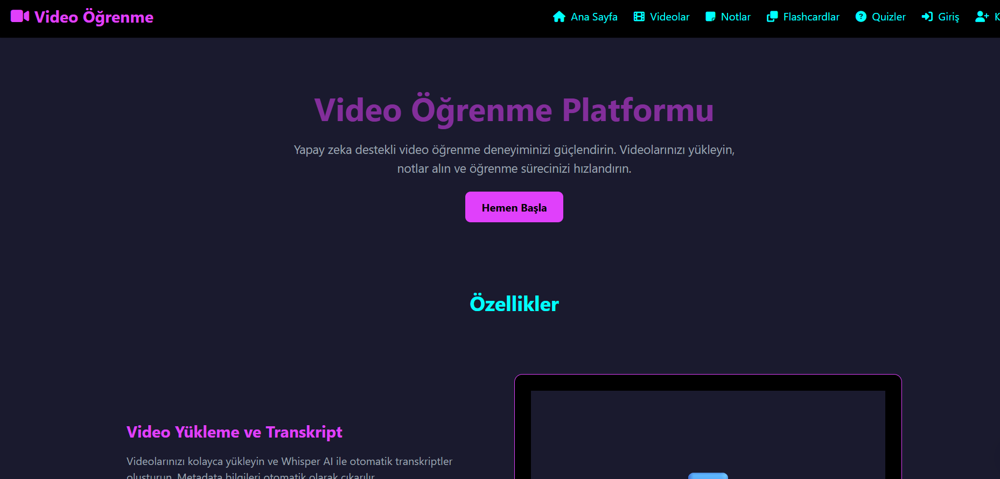
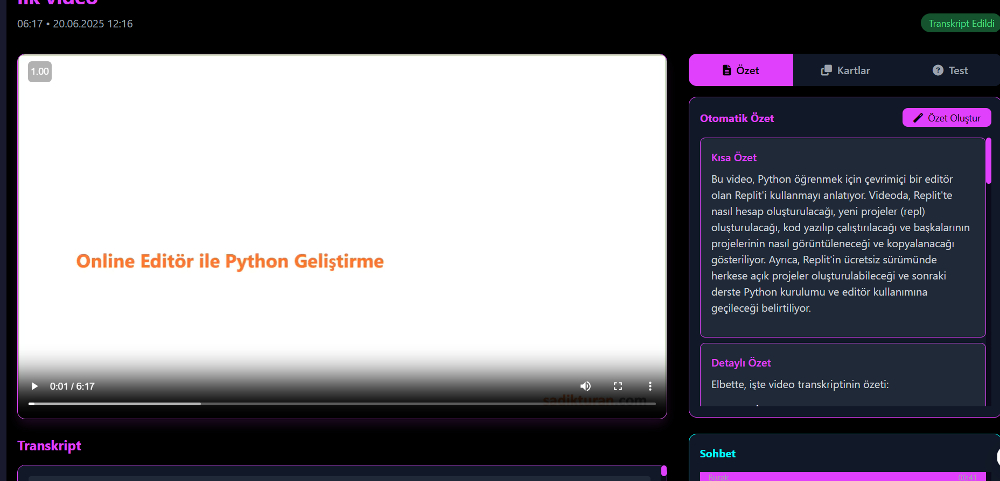
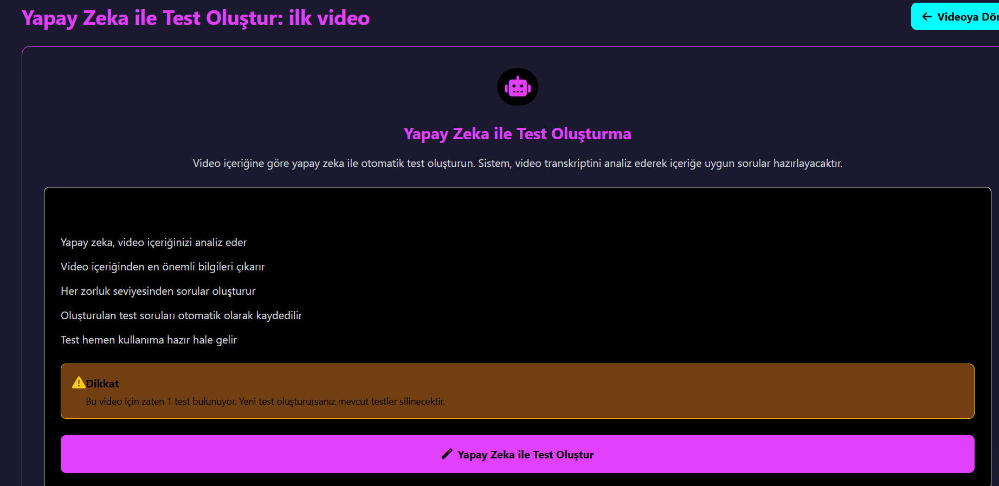
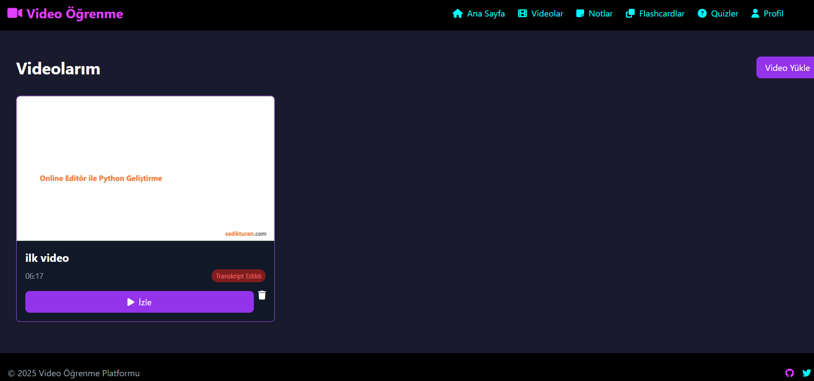
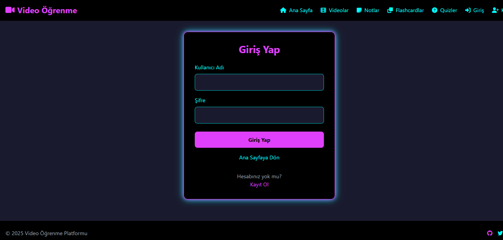
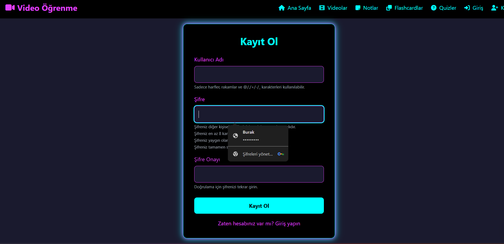
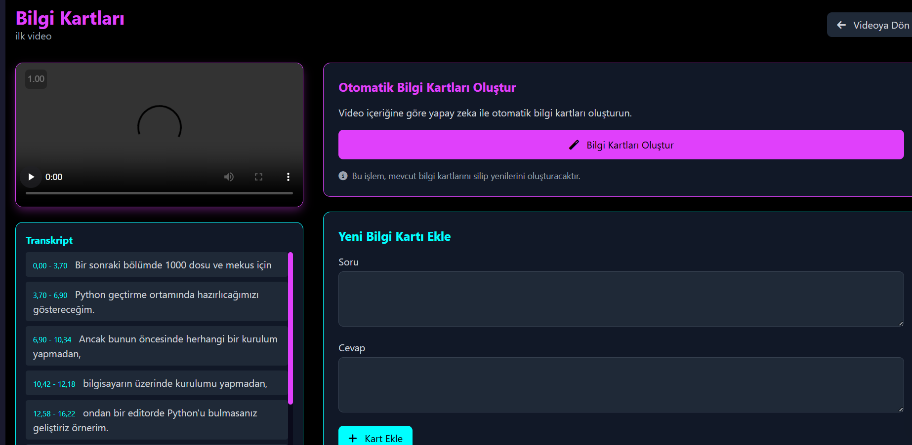

# 🎥 AI-Powered Video Learning Platform

An intelligent video learning platform that leverages **Large Language Models (LLMs)** and **AI Agents** to transform video content into interactive learning experiences. Built with Django, Whisper AI, and Google Gemini AI.



## 🌟 Key Features

### 🤖 AI-Powered Transcription
- **OpenAI Whisper large-v3** integration for high-accuracy speech-to-text
- Automatic video processing with time-stamped segments
- Multi-language support for transcription

### 💬 Intelligent AI Chat Agent
- **Google Gemini 1.5 Pro** powered conversational AI
- Context-aware responses based on video content
- Time-specific discussions about video segments
- Interactive learning through AI conversations



### 📚 Automatic Content Generation
- **AI-Generated Summaries**: Short and detailed summaries from video transcripts
- **Smart Flashcards**: Question-answer pairs automatically created from content
- **Intelligent Quizzes**: Multiple-choice tests generated by AI
- **Contextual Notes**: Time-stamped note-taking system

### 🎯 Interactive Video Player
- Custom video player with transcript synchronization
- Click-to-jump functionality from transcript to video timeline
- Real-time screenshot capture using HTML5 Canvas
- Progress tracking and bookmarking



### 🎨 Modern UI/UX
- **Neon-themed design** with dark mode aesthetics
- Fully responsive design (Mobile, Tablet, Desktop)
- TailwindCSS + Alpine.js for smooth interactions
- Accessibility-compliant interface (WCAG standards)

## 🏗️ Technical Architecture

### Backend Stack
- **Django 4.2.21** - Web framework
- **PostgreSQL** - Primary database
- **Celery + Redis** - Asynchronous task processing
- **Django REST Framework** - API endpoints

### AI/ML Integration
- **OpenAI Whisper** - Video transcription service
- **Google Gemini API** - LLM for chat, summaries, flashcards, and quizzes
- **MoviePy** - Video metadata extraction

### Frontend Technologies
- **TailwindCSS** - Modern CSS framework
- **Alpine.js** - Lightweight JavaScript framework
- **FilePond.js** - Advanced file upload component



## 🚀 Installation & Setup

### Prerequisites
- Python 3.9+
- PostgreSQL 12+
- Redis Server
- FFmpeg (for video processing)

### 1. Clone Repository
```bash
git clone https://github.com/yourusername/video-learning-platform.git
cd video-learning-platform
```

### 2. Create Virtual Environment
```powershell
python -m venv venv
.venv\Scripts\Activate.ps1  # Windows
# source venv/bin/activate    # Linux/macOS
```

### 3. Install Dependencies
```bash
pip install -r requirements.txt
```

### 4. Environment Configuration
Create `.env` file in project root:
```env
SECRET_KEY=your-django-secret-key
DEBUG=True
DB_NAME=education_db
DB_USER=postgres
DB_PASSWORD=your-password
DB_HOST=localhost
DB_PORT=5432
CELERY_BROKER_URL=redis://localhost:6379/0
CELERY_RESULT_BACKEND=redis://localhost:6379/0
GEMINI_API_KEY=your-gemini-api-key
```

### 5. Database Setup
```bash
python manage.py makemigrations
python manage.py migrate
python manage.py createsuperuser
```

### 6. Download Whisper Model
```bash
python -c "import whisper; whisper.load_model('large-v3')"
```

### 7. Start Services
```bash
# Terminal 1: Django Development Server
python manage.py runserver

# Terminal 2: Celery Worker
celery -A video_learning_platform worker --loglevel=info

# Terminal 3: Redis Server
redis-server
```



## 🎯 Usage Workflow

### 1. Video Upload & Processing
```
User uploads video → Metadata extraction → Whisper transcription → Ready for learning
```

### 2. AI Content Generation
```
Transcript analysis → Gemini API processing → Summaries/Flashcards/Quizzes generation
```

### 3. Interactive Learning
```
Video playback → AI chat interactions → Note-taking → Knowledge assessment
```



## 🧠 AI Agent Capabilities

### Context-Aware Conversations
The AI agent maintains conversation context and can:
- Answer questions about specific video segments
- Provide explanations about complex topics
- Generate follow-up questions for deeper learning
- Adapt responses based on user's learning progress

### Intelligent Content Creation
- **Summarization Agent**: Creates both brief and detailed summaries
- **Quiz Generator Agent**: Develops contextually relevant assessments
- **Flashcard Creator Agent**: Generates effective study materials
- **Discussion Facilitator**: Enables meaningful conversations about content

## 📊 Database Schema

### Core Models
- **Video**: File storage, metadata, processing status
- **TranscriptSegment**: Time-stamped text segments
- **ChatMessage**: AI conversation history
- **Note**: User annotations with timestamps
- **Summary**: AI-generated content summaries
- **Flashcard**: Question-answer learning pairs
- **Quiz/Question/Answer**: Assessment system



## 🔧 Configuration Options

### Whisper Models
```python
# Available models (in order of accuracy/resource requirements)
WHISPER_MODELS = [
    'tiny', 'base', 'small', 'medium', 'large-v1', 'large-v2', 'large-v3'
]
```

### Gemini API Models
```python
# Recommended models for different tasks
GEMINI_MODELS = {
    'chat': 'models/gemini-2.0-flash-lite',
    'summary': 'models/gemini-1.5-flash', 
    'quiz': 'models/gemini-1.5-pro'
}
```

## 🐳 Docker Deployment

```yaml
version: '3.8'
services:
  web:
    build: .
    ports:
      - "8000:8000"
    depends_on:
      - db
      - redis
  
  db:
    image: postgres:13
    environment:
      POSTGRES_DB: education_db
      POSTGRES_PASSWORD: password
  
  redis:
    image: redis:alpine
  
  worker:
    build: .
    command: celery -A video_learning_platform worker
    depends_on:
      - db
      - redis
```

## 🤝 Contributing

1. Fork the repository
2. Create feature branch (`git checkout -b feature/AmazingFeature`)
3. Commit changes (`git commit -m 'Add AmazingFeature'`)
4. Push to branch (`git push origin feature/AmazingFeature`)
5. Open Pull Request

## 📝 License

This project is licensed under the MIT License - see the [LICENSE](LICENSE) file for details.

## 🙏 Acknowledgments

- OpenAI Whisper team for speech recognition technology
- Google for Gemini AI API
- Django community for the excellent web framework
- Contributors and beta testers

---

# 🎥 Yapay Zeka Destekli Video Öğrenme Platformu

**Büyük Dil Modelleri (LLM)** ve **AI Ajanları** kullanarak video içeriklerini interaktif öğrenme deneyimlerine dönüştüren akıllı bir video öğrenme platformu. Django, Whisper AI ve Google Gemini AI ile geliştirilmiştir.


## 🌟 Temel Özellikler

### 🤖 AI Destekli Transkripsiyon
- **OpenAI Whisper large-v3** entegrasyonu ile yüksek doğrulukta konuşma-metin çevirisi
- Zaman damgalı segmentlerle otomatik video işleme
- Transkripsiyon için çoklu dil desteği

### 💬 Akıllı AI Sohbet Ajanı
- **Google Gemini 1.5 Pro** ile güçlendirilmiş konuşma AI'ı
- Video içeriğine dayalı bağlam-farkında yanıtlar
- Video segmentleri hakkında zamana özel tartışmalar
- AI konuşmaları aracılığıyla interaktif öğrenme


### 📚 Otomatik İçerik Üretimi
- **AI Üretimi Özetler**: Video transkriptlerinden kısa ve detaylı özetler
- **Akıllı Flashcard'lar**: İçerikten otomatik oluşturulan soru-cevap çiftleri
- **Akıllı Testler**: AI tarafından üretilen çoktan seçmeli testler
- **Bağlam-farkında Notlar**: Zaman damgalı not alma sistemi

### 🎯 İnteraktif Video Oynatıcı
- Transkript senkronizasyonu ile özel video oynatıcı
- Transkriptten video zaman çizelgesine tıklayarak atlama
- HTML5 Canvas kullanarak gerçek zamanlı ekran görüntüsü yakalama
- İlerleme takibi ve yer işaretleme


### 🎨 Modern UI/UX
- Karanlık mod estetiği ile **Neon temalı tasarım**
- Tam responsive tasarım (Mobil, Tablet, Masaüstü)
- Akıcı etkileşimler için TailwindCSS + Alpine.js
- Erişilebilirlik uyumlu arayüz (WCAG standartları)

## 🏗️ Teknik Mimari

### Backend Stack
- **Django 4.2.21** - Web framework
- **PostgreSQL** - Ana veritabanı
- **Celery + Redis** - Asenkron görev işleme
- **Django REST Framework** - API endpoints

### AI/ML Entegrasyonu
- **OpenAI Whisper** - Video transkripsiyon servisi
- **Google Gemini API** - Sohbet, özetler, flashcard'lar ve testler için LLM
- **MoviePy** - Video meta veri çıkarımı

### Frontend Teknolojileri
- **TailwindCSS** - Modern CSS framework
- **Alpine.js** - Hafif JavaScript framework
- **FilePond.js** - Gelişmiş dosya yükleme bileşeni


## 🚀 Kurulum ve Ayarlar

### Ön Gereksinimler
- Python 3.9+
- PostgreSQL 12+
- Redis Server
- FFmpeg (video işleme için)

### 1. Repository'yi Klonlama
```bash
git clone https://github.com/kullaniciadi/video-learning-platform.git
cd video-learning-platform
```

### 2. Sanal Ortam Oluşturma
```powershell
python -m venv venv
.venv\Scripts\Activate.ps1  # Windows
# source venv/bin/activate    # Linux/macOS
```

### 3. Bağımlılıkları Yükleme
```bash
pip install -r requirements.txt
```

### 4. Ortam Yapılandırması
Proje kök dizininde `.env` dosyası oluşturun:
```env
SECRET_KEY=django-gizli-anahtariniz
DEBUG=True
DB_NAME=education_db
DB_USER=postgres
DB_PASSWORD=sifreniz
DB_HOST=localhost
DB_PORT=5432
CELERY_BROKER_URL=redis://localhost:6379/0
CELERY_RESULT_BACKEND=redis://localhost:6379/0
GEMINI_API_KEY=gemini-api-anahtariniz
```

### 5. Veritabanı Kurulumu
```bash
python manage.py makemigrations
python manage.py migrate
python manage.py createsuperuser
```

### 6. Whisper Modeli İndirme
```bash
python -c "import whisper; whisper.load_model('large-v3')"
```

### 7. Servisleri Başlatma
```bash
# Terminal 1: Django Development Server
python manage.py runserver

# Terminal 2: Celery Worker
celery -A video_learning_platform worker --loglevel=info

# Terminal 3: Redis Server
redis-server
```


## 🎯 Kullanım İş Akışı

### 1. Video Yükleme ve İşleme
```
Kullanıcı video yükler → Meta veri çıkarımı → Whisper transkripsiyon → Öğrenmeye hazır
```

### 2. AI İçerik Üretimi
```
Transkript analizi → Gemini API işleme → Özetler/Flashcard'lar/Testler üretimi
```

### 3. İnteraktif Öğrenme
```
Video oynatma → AI sohbet etkileşimleri → Not alma → Bilgi değerlendirmesi
```


## 🧠 AI Ajanı Yetenekleri

### Bağlam-Farkında Konuşmalar
AI ajanı konuşma bağlamını korur ve şunları yapabilir:
- Belirli video segmentleri hakkında soruları yanıtlama
- Karmaşık konular hakkında açıklamalar sağlama
- Daha derin öğrenme için takip soruları üretme
- Kullanıcının öğrenme ilerlemesine göre yanıtları uyarlama

### Akıllı İçerik Oluşturma
- **Özetleme Ajanı**: Hem kısa hem detaylı özetler oluşturur
- **Test Üretici Ajanı**: Bağlama uygun değerlendirmeler geliştirir
- **Flashcard Yaratıcı Ajanı**: Etkili çalışma materyalleri üretir
- **Tartışma Kolaylaştırıcısı**: İçerik hakkında anlamlı konuşmalar sağlar

## 📊 Veritabanı Şeması

### Ana Modeller
- **Video**: Dosya depolama, meta veri, işleme durumu
- **TranscriptSegment**: Zaman damgalı metin segmentleri
- **ChatMessage**: AI konuşma geçmişi
- **Note**: Zaman damgalı kullanıcı açıklamaları
- **Summary**: AI üretimi içerik özetleri
- **Flashcard**: Soru-cevap öğrenme çiftleri
- **Quiz/Question/Answer**: Değerlendirme sistemi


## 🔧 Yapılandırma Seçenekleri

### Whisper Modelleri
```python
# Mevcut modeller (doğruluk/kaynak gereksinimlerine göre sıralı)
WHISPER_MODELS = [
    'tiny', 'base', 'small', 'medium', 'large-v1', 'large-v2', 'large-v3'
]
```

### Gemini API Modelleri
```python
# Farklı görevler için önerilen modeller
GEMINI_MODELS = {
    'chat': 'models/gemini-2.0-flash-lite',
    'summary': 'models/gemini-1.5-flash', 
    'quiz': 'models/gemini-1.5-pro'
}
```

## 🐳 Docker Deployment

```yaml
version: '3.8'
services:
  web:
    build: .
    ports:
      - "8000:8000"
    depends_on:
      - db
      - redis
  
  db:
    image: postgres:13
    environment:
      POSTGRES_DB: education_db
      POSTGRES_PASSWORD: password
  
  redis:
    image: redis:alpine
  
  worker:
    build: .
    command: celery -A video_learning_platform worker
    depends_on:
      - db
      - redis
```

## 🤝 Katkıda Bulunma

1. Repository'yi fork edin
2. Özellik branch'i oluşturun (`git checkout -b feature/HarikaOzellik`)
3. Değişiklikleri commit edin (`git commit -m 'HarikaOzellik Eklendi'`)
4. Branch'e push edin (`git push origin feature/HarikaOzellik`)
5. Pull Request açın

## 📝 Lisans

Bu proje MIT Lisansı altında lisanslanmıştır - detaylar için [LICENSE](LICENSE) dosyasına bakın.

## 🙏 Teşekkürler

- Konuşma tanıma teknolojisi için OpenAI Whisper ekibi
- Gemini AI API için Google
- Mükemmel web framework için Django topluluğu
- Katkıda bulunanlar ve beta test kullanıcıları